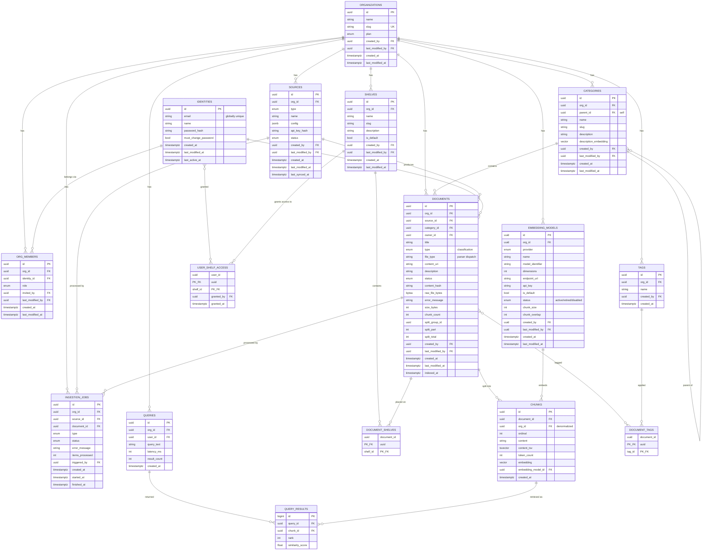

# knowledge Data Model

Postgres schema (via `pgvector`), managed by Alembic migrations in `api/migrations/versions/`.
ORM source of truth: `api/infrastructure/orm/`. As of `0001_initial_schema.py` this is a **single
clean baseline** — this app has no production deployment yet, so rather than carry an incremental
migration history transforming the old single-tenant "libraries" schema into this multi-tenant
one, the whole schema was squashed into one migration that creates the target shape directly.
There is no `libraries` table anywhere in history.

Design source: the "Knowledge data library pages" `DataModel-Spec.dc.html`/`schema.sql` mockup
this app was designed against, with deliberate, documented deviations — see
[Deviations from the design spec](#deviations-from-the-design-spec) below. That mockup lives
outside this repo (gitignored, untracked) and is not itself a build artifact — this document is
the durable reference.

**Backend status:** schema, ORM, domain entities, repositories, application services, and
presentation routes all reflect this document — `/categories`, `/documents`, `/categories/{id}/
query`, and `/query` (router RAG across categories) are all org/category-shaped, not library-shaped.
There is no `mcp_server/` anymore (removed entirely, see
[Removed: OAuth2 and MCP](#removed-oauth2-and-mcp) below). Every resource route now requires a real
session (`api.presentation.routes.auth_ui.require_org_session`), resolving `org_id`/`user_id` from
the caller's session rather than a bootstrap default — see
[Identity and org membership](#identity-and-org-membership) below. See
[Known gaps](#known-gaps) for what's still open.

## Entity-relationship overview

---

## Tenancy & access

### `organizations`

The tenant boundary. Every table below carries a NOT NULL `org_id` FK to this table (directly, or
denormalized on `chunks`).

| Column | Type | Nullable | Notes |
|---|---|---|---|
| `id` | `uuid` | no | PK |
| `name` | `string` | no | |
| `slug` | `string` | no | **unique** |
| `plan` | `org_plan` enum | no | `free` \| `team` \| `enterprise`, default `free` |
| `created_by` / `last_modified_by` | `uuid` | yes | FK → `identities.id`; added via `ALTER TABLE` after `identities` exists (circular FK — see migration) |
| `created_at` / `last_modified_at` | `timestamptz` | no | |

One bootstrap row (`slug='default'`) is created automatically on first app start
(`api/infrastructure/auth/bootstrap.py:bootstrap_default_organization`).

---

## Identity and org membership

Split into two tables — a person, and which orgs that person belongs to — rather than one org-
scoped `users` table (see [Deviations](#deviations-from-the-design-spec) item 10 for why). Mirrors
how platform.claude/platform.openai split "who is this person" from "which workspace are they
acting in": one identity can hold a different membership (and role) in several orgs and switch
between them (`POST /orgs/<id>/switch`).

### `identities`

A person, wholly org-independent.

| Column | Type | Nullable | Notes |
|---|---|---|---|
| `id` | `uuid` | no | PK |
| `email` | `string` | no | **globally unique** (`uq_identities_email`) — not per-org |
| `name` | `string` | no | |
| `password_hash` | `string` | no | today's only `IdentityVerifierPort` implementation is local password auth (`PasswordIdentityVerifier`) — swappable later for SSO/social login without touching org/membership code |
| `must_change_password` | `bool` | no | default `true` — `true` for the bootstrap admin and for identities created via an invite (random unusable password); `false` for a real self-serve signup, which sets its own password |
| `created_at` / `last_modified_at` | `timestamptz` | no | |
| `last_active_at` | `timestamptz` | yes | |

The bootstrap admin (`admin`/`admin`, forced password change) is created under the bootstrap org on
first app start (`bootstrap_default_identity`).

### `org_members`

Which orgs an identity belongs to, and with what role. Role gates write access: contributors
add/edit their own documents, admins manage sources and members, viewers only browse and search —
`invites`/role-management routes enforce "caller must be an admin of this org"
(`api.presentation.routes.orgs._require_admin`); category/document/query routes themselves don't
yet check role beyond "has a membership at all" (see [Known gaps](#known-gaps)).

| Column | Type | Nullable | Notes |
|---|---|---|---|
| `id` | `uuid` | no | PK |
| `org_id` | `uuid` | no | FK → `organizations.id`, `ON DELETE CASCADE` |
| `identity_id` | `uuid` | no | FK → `identities.id`, `ON DELETE CASCADE` |
| `role` | `user_role` enum | no | `admin` \| `contributor` \| `viewer`, default `viewer` |
| `invited_by` / `last_modified_by` | `uuid` | yes | FK → `identities.id` |
| `created_at` / `last_modified_at` | `timestamptz` | no | |

**Constraint:** `uq_org_members_org_id_identity_id` — one membership row per (org, identity) pair.

A new signup (`POST /signup`) gets a real identity plus its own personal org (owner/admin role) —
mirrors platform.claude/platform.openai's first-login personal workspace. `POST
/orgs/<id>/invites` adds an existing or brand-new identity to an org with a given role.

---

## Embedding models — bring your own, per org

### `embedding_models`

An org's registered embedders — many rows per org, unlike the old single global active provider.

| Column | Type | Nullable | Notes |
|---|---|---|---|
| `id` | `uuid` | no | PK |
| `org_id` | `uuid` | no | FK → `organizations.id`, `ON DELETE CASCADE` |
| `provider` | `embed_provider` enum | no | `voyage` \| `openai_compatible` — **this app's actual registry values**, not the design spec's literal `openai`/`cohere`/`voyage`/`self_hosted`/`custom` list, which doesn't match what `EmbeddingProviderRegistry` can construct a client for |
| `name` | `string` | no | display name |
| `model_identifier` | `string` | no | provider's model name |
| `dimensions` | `int` | no | verified live against the provider's actual output at save time |
| `endpoint_url` | `string` | yes | set for self-hosted/custom |
| `api_key` | `string` | yes | plaintext, not a hash — deviation from the spec's `api_key_hash`; this app calls the provider's API with it directly on every embed, unlike an OAuth2 client secret that's never needed again after issuance |
| `is_default` | `bool` | no | the one model new ingestion uses; can only be `true` when `status='active'` (`embedding_models_default_is_active` check constraint) |
| `status` | `embed_model_status` enum | no | `active` \| `retired` \| `disabled`, default `disabled` |
| `chunk_size` / `chunk_overlap` | `int` | no | **kept here**, not moved to `sources` as the design spec implied — chunking config is resolved alongside provider/model/dimensions in one repository call; splitting it across two tables would be a real ingestion-service behavior change, not a schema decision |
| `created_by` / `last_modified_by` | `uuid` | yes | FK → `identities.id` |
| `created_at` / `last_modified_at` | `timestamptz` | no | |

**Constraints:**
- `embedding_models_one_active_per_org` — partial unique index on `org_id` `WHERE status = 'active'`: at most one active model per org.
- `embedding_models_default_is_active` — check constraint: `is_default` implies `status = 'active'`.
- **`embedding_models_guard` trigger** (`guard_embedding_model_change()`): blocks deleting a model that still has chunks, and blocks moving a model with chunks to `disabled` — the only transition left for it is `retired` (kept, read-only, for those chunks' provenance). A model with zero chunks can be freely deleted or disabled. This is the first DB-level trigger in this app (everything else validates in application code) — added because the invariant ("never lose provenance for chunks still in use") is cheap to enforce at the data layer and easy to violate accidentally from application code.

---

## Sources, categories & shelves

### `sources`

Where content comes from: a manual upload, a URL, or a connected system.

| Column | Type | Nullable | Notes |
|---|---|---|---|
| `id` | `uuid` | no | PK |
| `org_id` | `uuid` | no | FK → `organizations.id`, `ON DELETE CASCADE` |
| `type` | `source_type` enum | no | `upload` \| `url` \| `connector` |
| `name` | `string` | no | |
| `config` | `jsonb` | no | connector-specific settings, default `{}` |
| `api_key_hash` | `string` | yes | connectors that pull from an external API store only the hash |
| `status` | `source_status` enum | no | `active` \| `paused` \| `error`, default `active` |
| `created_by` / `last_modified_by` | `uuid` | yes | FK → `identities.id` |
| `created_at` / `last_modified_at` | `timestamptz` | no | |
| `last_synced_at` | `timestamptz` | yes | |

### `categories`

A self-referencing tree — subcategories are just categories with a `parent_id`. This is the
direct successor of the old `libraries` table for *browsing/organizing* documents (see
[Deviations](#deviations-from-the-design-spec)).

| Column | Type | Nullable | Notes |
|---|---|---|---|
| `id` | `uuid` | no | PK |
| `org_id` | `uuid` | no | FK → `organizations.id`, `ON DELETE CASCADE` |
| `parent_id` | `uuid` | yes | FK → `categories.id` (self), `ON DELETE SET NULL` |
| `name` | `string` | no | |
| `slug` | `string` | no | unique per org (`uq_categories_org_id_slug`) |
| `description` | `string` | yes | |
| `description_embedding` | `vector` (dimensionless) | yes | router RAG — the direct successor of `libraries.description_embedding`: routes a category-less query to the most relevant category by cosine similarity. No HNSW index (small counts, sequential `ORDER BY ... <=>` scan is trivial); dimension-safety enforced in application code, not the schema, same as its predecessor. Nothing reads/writes this yet. |
| `created_by` / `last_modified_by` | `uuid` | yes | FK → `identities.id` |
| `created_at` / `last_modified_at` | `timestamptz` | no | |

### `shelves`, `document_shelves`, `user_shelf_access`

Access-controlled groupings, independent of the category tree — a category is about
browsing/taxonomy, a shelf is about *who can see what*. Not in any prior iteration of this app;
introduced when the design spec added this concept.

**`shelves`**: `id` PK, `org_id` FK (CASCADE), `name`/`slug` (unique per org), `description`,
`is_default` bool (the shelf every new document lands on and every member can see unless
narrowed), `created_by`/`last_modified_by` FK → identities, `created_at`/`last_modified_at`.

**`document_shelves`**: `document_id` FK (CASCADE) + `shelf_id` FK (CASCADE), composite PK — a
document can sit on several shelves. Indexed on `shelf_id` (`ix_document_shelves_shelf_id`) for
"given a shelf, list its documents" lookups (the PK alone only serves "given a document, list its
shelves" efficiently).

**`user_shelf_access`**: `user_id` FK (CASCADE) + `shelf_id` FK (CASCADE), composite PK,
`granted_by` FK → identities (nullable), `granted_at`. A member sees only documents on a shelf they've
been granted — enforced by the `shelf_gated_read` RLS policy (see
[Row-level security](#row-level-security)), not yet by application code.

---

## Content

### `documents`

The browsable unit.

| Column | Type | Nullable | Notes |
|---|---|---|---|
| `id` | `uuid` | no | PK |
| `org_id` | `uuid` | no | FK → `organizations.id`, `ON DELETE CASCADE` |
| `source_id` | `uuid` | yes | FK → `sources.id`, `ON DELETE SET NULL` |
| `category_id` | `uuid` | yes | FK → `categories.id`, `ON DELETE SET NULL` |
| `owner_id` | `uuid` | no | FK → `identities.id` |
| `title` | `string` | no | display/editable name — replaces the old `source_filename` (`DocumentRepository.rename` still renames this field) |
| `type` | `document_type` enum | no | `article` \| `dataset` \| `guide` \| `report` \| `faq` \| `media` — **classification**, distinct from `file_type` below |
| `file_type` | `string` | no | technical upload format (`pdf`/`md`/`txt`/`html`) driving parser selection (`api/infrastructure/parsing/registry.py`) — an extension beyond the design spec, which has no equivalent concept |
| `content_uri` | `string` | yes | pointer to blob storage — nullable and unpopulated for now, no blob storage exists yet; uploads still live in `raw_file_bytes` |
| `description` | `string` | yes | |
| `status` | `document_status` enum | no | `processing` \| `indexed` \| `failed` \| `archived`, default `processing` — **different value set** than the pre-squash app's free-string status (`pending`/`processing`/`completed`/`failed`/`cancelled`); mapping isn't wired up in application code yet |
| `content_hash` | `string` | no | SHA-256 of the uploaded bytes, for dedup — extension beyond the spec |
| `raw_file_bytes` | `bytea` | yes | deferred-loaded (not fetched on plain list/get queries); kept only until a document reaches `indexed`, so a failed ingestion can be retried without re-upload |
| `error_message` | `string` | yes | failure reason, surfaced to retry callers |
| `size_bytes` | `int` | yes | set at upload time |
| `chunk_count` | `int` | yes | set once ingestion completes; `NULL` means "not available yet" vs. `0` meaning "completed with zero chunks" |
| `split_group_id` / `split_part` / `split_total` | `uuid` / `int` / `int` | yes | set together, only for a document that's one part of an auto-split oversized PDF (`PdfSplitIngestionService`) |
| `created_by` / `last_modified_by` | `uuid` | yes | FK → `identities.id` |
| `created_at` / `last_modified_at` | `timestamptz` | no | |
| `indexed_at` | `timestamptz` | yes | set on successful completion — replaces the old `ingested_at` |

### `tags` / `document_tags`

**`tags`**: `id` PK, `org_id` FK (CASCADE), `name` (unique per org: `uq_tags_org_id_name`),
`created_by` FK → identities, `created_at`.

**`document_tags`**: `document_id` FK (CASCADE) + `tag_id` FK (CASCADE), composite PK — many-to-many
folksonomy independent of the category tree.

### `ingestion_jobs`

One row per processing run: an upload, a crawl, a resync, or a manual reindex. Persisted history —
replaces the pre-squash app's in-memory-only `JobStore`/`CrawlJobStore` (lost on process restart).

| Column | Type | Nullable | Notes |
|---|---|---|---|
| `id` | `uuid` | no | PK |
| `org_id` | `uuid` | no | FK → `organizations.id`, `ON DELETE CASCADE` |
| `source_id` | `uuid` | yes | FK → `sources.id`, `ON DELETE SET NULL` |
| `document_id` | `uuid` | yes | FK → `documents.id`, `ON DELETE SET NULL` — null while the job covers a whole source |
| `type` | `ingestion_type` enum | no | `upload` \| `crawl` \| `resync` \| `reindex` |
| `status` | `ingestion_status` enum | no | `queued` \| `processing` \| `indexed` \| `failed`, default `queued` |
| `error_message` | `string` | yes | |
| `items_processed` | `int` | no | default `0` |
| `triggered_by` | `uuid` | yes | FK → `identities.id` — null for scheduled/system resyncs |
| `created_at` / `started_at` / `finished_at` | `timestamptz` | no / yes / yes | |

Nothing writes to this table yet — the in-memory `JobStore`/`CrawlJobStore` are still what
`DocumentService` actually uses (see [Known gaps](#known-gaps)).

---

## Retrieval

### `chunks`

The retrieval grain — immutable, single-write rows (no `last_modified_*`; a re-embed writes a new
row via a `reindex` ingestion job).

| Column | Type | Nullable | Notes |
|---|---|---|---|
| `id` | `uuid` | no | PK |
| `document_id` | `uuid` | no | FK → `documents.id`, `ON DELETE CASCADE` |
| `org_id` | `uuid` | no | FK → `organizations.id`, `ON DELETE CASCADE` — denormalized from the parent document so RLS/ANN filters never need a join |
| `ordinal` | `int` | no | position within the source document — replaces the old `chunk_index` |
| `content` | `string` | no | |
| `content_tsv` | `tsvector` | no | **generated column** (`to_tsvector('english', content)`), GIN-indexed (`ix_chunks_content_tsv_gin`) — not in the design spec at all; it's the sparse half of this app's hybrid (dense+sparse RRF) search |
| `token_count` | `int` | no | |
| `embedding` | `vector` (dimensionless) | no | **deliberately no fixed width** — a genuine deviation from the design spec's `vector(1536)`. Per-org "bring your own embedding model" means different orgs (and a mid-reindex org) can have different `dimensions`; a single fixed-width column can't represent that. `ChunkRepository.resize_embedding_column()` changes the real column's width with raw SQL at runtime, the same mechanism the pre-squash app used for its one-time Voyage→Ollama cutover, generalized. **No HNSW index is created until a model is actually configured** — pgvector requires a fixed-width column to build one; `resize_embedding_column()` creates `ix_chunks_embedding_hnsw` (`DROP INDEX IF EXISTS` + `CREATE INDEX`, idempotent) the first time an org enables a model. |
| `embedding_model_id` | `uuid` | no | FK → `embedding_models.id` — which model actually produced this vector |
| `created_at` | `timestamptz` | no | |

**Known hard problem, not solved by this schema:** a single HNSW index is only efficient for one
dimension family. With multiple orgs on different-dimension models sharing this one physical
table, either (a) all orgs are constrained to the same embedding dimension for now, or (b)
per-dimension partial HNSW indexes get built dynamically as new dimensions appear. Neither is
implemented — this is real follow-up work, not yet blocking because there's only ever been one
org with one configured model in practice so far.

### `queries` / `query_results`

Persisted search log — replaces the pre-squash app's `logging.info()`-only query tracking.

**`queries`**: `id` PK, `org_id` FK (CASCADE), `user_id` FK → identities (`ON DELETE SET NULL`, nullable
— API callers may be unauthenticated service accounts), `query_text`, `latency_ms`, `result_count`,
`created_at`. Indexed on `(org_id, created_at)`.

**`query_results`**: `id` bigserial PK, `query_id` FK → queries (`ON DELETE CASCADE`), `chunk_id`
FK → chunks (`ON DELETE CASCADE` — a deviation from the design spec's unspecified/implicit-RESTRICT
reference, matching this app's cascade-everywhere convention elsewhere), `rank`, `similarity_score`.
Indexed on `query_id`.

Nothing writes to either table yet — `RetrievalService`/`CategoryRouterService` still only log,
they don't persist (see [Known gaps](#known-gaps)).

---

## Removed: OAuth2 and MCP

This app previously carried its own OAuth2 client registry (`applications`, `refresh_tokens`,
`authorization_codes` — none of it part of the design spec) plus three global settings tables
(`search_settings`, `web_crawl_settings`, `router_settings`) and a bundled MCP server
(`mcp_server/`, streamable-HTTP, org-unaware). All of it has been removed entirely:

- **Auth is owned by this app itself, not a third-party IdP.** After evaluating Auth0 (can't hand
  back an `org_id`) and a self-hosted multi-tenant IdP (Zitadel — models orgs as an IdP-level
  concept, more than this needs), the decision was to keep "prove who this person is" and "which
  org/role" separate, both inside this app — see
  [Identity and org membership](#identity-and-org-membership). "Prove who this person is" is
  behind `IdentityVerifierPort` (`api/domain/ports.py`), so swapping local password auth for real
  SSO later doesn't touch org/membership code.
- **`search_settings`/`web_crawl_settings`/`router_settings`'s values are now fixed `DEFAULT_*`
  constants in `api/constants.py`** (`DEFAULT_DENSE_K`/`DEFAULT_SPARSE_K`/`DEFAULT_RRF_K`,
  `DEFAULT_WEB_CRAWL_USER_AGENT`, `DEFAULT_ROUTER_TOP_N`/`DEFAULT_ROUTER_MIN_SIMILARITY`) instead
  of admin-configurable per-org rows — not yet reintroduced as real per-org settings.
- **`mcp_server/` is gone.** MCP integration may return later, designed against a real auth layer
  from the start rather than retrofitted onto it.

---

## Row-level security

RLS is **enabled with policies created**, matching the design spec's list of tables (`org_members`
in place of the spec's `users` — see [Identity and org membership](#identity-and-org-membership);
`identities` itself is global, not org-scoped, so it carries no RLS policy, same reasoning as
`organizations`), plus `embedding_models`, `sources`, `categories`, `documents`, `ingestion_jobs`,
`tags`, `chunks`, `queries`, `shelves`, `document_shelves`, `user_shelf_access` — but **still
practically inert**. This app's single Postgres role (`POSTGRES_USER`, default `rag`) both runs
migrations (so it owns every table) and serves every app query, and Postgres exempts table owners
from their own RLS policies unless `FORCE ROW LEVEL SECURITY` is also set (it isn't, matching the
design spec). Every request now resolves a real `org_id`/`user_id` from the caller's session
(`api.presentation.routes.auth_ui.require_org_session`/`login_required`) and sets the
transaction-scoped `app.org_id`/`app.user_id` these policies check
(`api.container.set_rls_session_vars`, via `set_config(..., true)` — Postgres doesn't accept a
bind parameter as a plain `SET LOCAL`'s value) — but until a later phase introduces a restricted,
non-owner DB role, this app's own role stays exempt from its own policies regardless.

Every RLS table has a `tenant_isolation` policy (`org_id = current_setting('app.org_id')::uuid`;
`document_shelves`/`user_shelf_access` don't carry `org_id` directly, so theirs check through the
parent `documents`/`shelves` row instead).

**One deliberate fix over the design spec's literal policies**: `documents` also has a
`shelf_gated_read` policy, written as a single **RESTRICTIVE** policy (an `org_members` row with
`role = 'admin'` for the current org, OR has shelf access via `document_shelves`/
`user_shelf_access`) rather than the spec's three separate
PERMISSIVE policies (`tenant_isolation`/`admin_bypass_shelf_gate`/`shelf_gated_read`). Postgres
ORs permissive policies together, so as literally spec'd, satisfying `tenant_isolation` alone
(same org) would already be sufficient to see a document — the shelf checks would never actually
restrict anything, contradicting the spec's own stated intent ("a document is only retrievable by
a user who has access to at least one of its shelves"). The RESTRICTIVE policy ANDs against
`tenant_isolation` instead, so a row is visible only when *both* hold: same org, **and** (admin or
granted shelf access).

---

## Deviations from the design spec

Consolidated list — see inline notes above for the full rationale on each:

1. `embed_provider` enum uses this app's actual three registry values, not the spec's literal five.
2. `chunks.embedding` is dimensionless, not a fixed `vector(1536)`.
3. `chunks.content_tsv` exists (sparse search); the spec has no equivalent.
4. `documents` keeps `file_type`, `content_hash`, `size_bytes`, `chunk_count`, `raw_file_bytes`,
   `split_group_id`/`split_part`/`split_total`, `error_message` alongside the spec's `content_uri`.
5. `embedding_models.chunk_size`/`chunk_overlap` stay on that table, not moved to `sources`.
6. `embedding_models.api_key` is plaintext, not `api_key_hash` — this app needs the real key to
   call the provider, unlike an OAuth2 secret.
7. The `shelf_gated_read` RLS policy is RESTRICTIVE, not three OR'd PERMISSIVE policies.
8. `libraries` is gone entirely, replaced by `categories` (browsing/taxonomy) — the spec never had
   a `libraries` table to begin with; this is this app's own migration path, not a spec deviation.
9. `applications`/`refresh_tokens`/`authorization_codes`/`search_settings`/`web_crawl_settings`/
   `router_settings` — this app's own machinery, not part of the spec — have been removed entirely
   rather than kept and org-scoped; see [Removed: OAuth2 and MCP](#removed-oauth2-and-mcp).
10. The spec's single org-scoped `users` table is split into `identities` (email globally unique,
    org-independent) and `org_members` (org + role, many per identity) — see
    [Identity and org membership](#identity-and-org-membership).

## Known gaps

Everything below the database layer (schema, ORM, domain, repositories — all of which fully
implement the schema above) still has open work:

- **Role enforcement is partial.** Every resource route now requires a real session
  (`require_org_session`), and org membership management (`POST /orgs/<id>/invites`, member role
  updates/removal) requires the caller to be an `admin` of that specific org. But
  category/document/query/embedding-settings routes only check "has *some* membership in this
  org," not contributor-vs-admin-vs-viewer — a viewer can currently write just like a contributor
  or admin. Shelf-gating (the `shelf_gated_read` RLS policy) isn't enforced in application code
  either, and the RLS policy itself is still inert — see
  [Row-level security](#row-level-security). No frontend (login/signup/org-switcher/invite UI in
  `webui/`) exists yet for any of this.
- **`ingestion_jobs` and `queries`/`query_results` are unused.** `DocumentService` still tracks
  ingestion/crawl jobs in the in-memory `JobStore`/`CrawlJobStore` (lost on process restart, per
  worker); `RetrievalService`/`CategoryRouterService` only log a query, they don't persist it.
- **`sources`, `tags`/`document_tags`, and `shelves`/`document_shelves`/`user_shelf_access` have no
  application-layer surface yet** (no service, no routes) — the tables and repositories exist, but
  nothing creates or reads rows in them yet.
