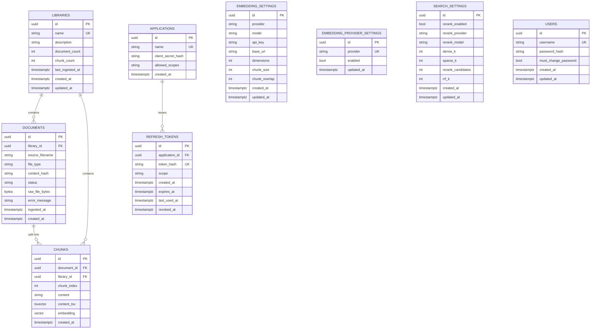

# knowledge-api Data Model

Postgres schema (via `pgvector`), managed by Alembic migrations in `migrations/versions/`.
ORM source of truth: `app/infrastructure/orm/`. Migration history: `0001` → `0010` (see
`CLAUDE.md` for the narrative behind each one).

## Entity-relationship overview

`EMBEDDING_SETTINGS`, `EMBEDDING_PROVIDER_SETTINGS`, and `SEARCH_SETTINGS` have no foreign keys
to anything else — they're global, application-wide configuration (single-row or small
lookup tables), not scoped to a library.

---

## `libraries`

A named collection of documents. Chunking/embedding config is **not** per-library — it's global
(`embedding_settings`), so this table only tracks identity and running counts.

| Column | Type | Nullable | Default | Notes |
|---|---|---|---|---|
| `id` | `uuid` | no | — | PK |
| `name` | `string` | no | — | **unique** |
| `description` | `string` | yes | — | |
| `document_count` | `integer` | no | `0` | maintained by `LibraryRepository.increment_counts` |
| `chunk_count` | `integer` | no | `0` | maintained by `LibraryRepository.increment_counts` |
| `last_ingested_at` | `timestamptz` | yes | — | |
| `created_at` | `timestamptz` | no | `now()` | |
| `updated_at` | `timestamptz` | no | `now()`, on update `now()` | |

Originally (migration `0001`) also carried `embedding_provider` / `embedding_model` /
`chunk_size` / `chunk_overlap`; migration `0005` dropped all four in favor of the single global
`embedding_settings` row — there was never a real per-library override use case.

## `documents`

One row per uploaded file within a library.

| Column | Type | Nullable | Default | Notes |
|---|---|---|---|---|
| `id` | `uuid` | no | — | PK |
| `library_id` | `uuid` | no | — | FK → `libraries.id`, `ON DELETE CASCADE`, indexed (`ix_documents_library_id`) |
| `source_filename` | `string` | no | — | |
| `file_type` | `string` | no | — | extension, e.g. `pdf`, `md`, `txt` |
| `content_hash` | `string` | no | — | SHA-256 of the uploaded bytes |
| `status` | `string` | no | `"pending"` | `pending` \| `processing` \| `completed` \| `failed` |
| `raw_file_bytes` | `bytea` | yes | — | added in `0008`; deferred-loaded (not fetched on list queries); kept only until ingestion completes, so a failed document can be retried without re-upload |
| `error_message` | `string` | yes | — | added in `0008`; failure reason, surfaced to retry callers |
| `ingested_at` | `timestamptz` | yes | — | set on successful completion |
| `created_at` | `timestamptz` | no | `now()` | |

## `chunks`

The retrieval unit: one row per chunk produced from a document, holding both its dense vector
and (via a generated column) its sparse/keyword representation.

| Column | Type | Nullable | Default | Notes |
|---|---|---|---|---|
| `id` | `uuid` | no | — | PK |
| `document_id` | `uuid` | no | — | FK → `documents.id`, `ON DELETE CASCADE`, indexed (`ix_chunks_document_id`) |
| `library_id` | `uuid` | no | — | FK → `libraries.id`, `ON DELETE CASCADE`, indexed (`ix_chunks_library_id`); denormalized from `document_id` so similarity/sparse search never needs a join |
| `chunk_index` | `integer` | no | — | position within the source document |
| `content` | `string` | no | — | chunk text |
| `content_tsv` | `tsvector` | no | **generated**: `to_tsvector('english', content)` | added in `0003`, GIN-indexed (`ix_chunks_content_tsv_gin`) for sparse/keyword search; Postgres keeps it in sync automatically, no app code ever writes it |
| `embedding` | `vector(N)` | no | — | dense embedding; `N` = whatever `embedding_settings.dimensions` currently is. HNSW-indexed (`ix_chunks_embedding_hnsw`, cosine ops). **Dynamically resized at runtime** (`ChunkRepository.resize_embedding_column`) when the configured embedding model changes with zero existing chunks — see `embedding_settings` below |
| `created_at` | `timestamptz` | no | `now()` | |

Column history: created at a fixed `Vector(1024)` (Voyage) in `0001`; migrations `0006`/`0007`
did a one-time hand-rolled cutover to `Vector(768)` (Ollama) via a nullable shadow column +
backfill + rename; as of the "bring your own embeddings model" change, the column is resized
in-place via `ALTER TABLE ... TYPE vector(N)` whenever the admin selects a new model — no shadow
column/backfill needed since a resize is only ever allowed while the table has zero rows (see
`embedding_settings` below).

## `embedding_settings`

**Single global row** (application-level singleton — no DB-level `UNIQUE`/check constraint
enforcing exactly one row, just always queried with `.first()`). Configures which embedding
provider/model every library uses; there is no per-library embedding config.

| Column | Type | Nullable | Default | Notes |
|---|---|---|---|---|
| `id` | `uuid` | no | — | PK |
| `provider` | `string` | no | — | must be a name registered in `EmbeddingProviderRegistry` (`voyage`, `ollama`, `openai_compatible`) |
| `model` | `string` | no | — | free text — no whitelist; any model name the provider accepts |
| `api_key` | `string` | yes | — | nullable since `0006` (self-hosted providers need none) |
| `base_url` | `string` | yes | — | added in `0006`; required for `openai_compatible`, optional override for `ollama` |
| `dimensions` | `integer` | no | — | added in `0009`; caller-declared, verified live against the provider's actual output at save time. Source of truth for `chunks.embedding`'s current column width |
| `chunk_size` | `integer` | no | `800` | added in `0005` (moved from `libraries`) |
| `chunk_overlap` | `integer` | no | `100` | added in `0005` (moved from `libraries`) |
| `created_at` | `timestamptz` | no | `now()` | |
| `updated_at` | `timestamptz` | no | `now()`, on update `now()` | |

Changing `provider`/`model`/`base_url`/`dimensions` is **rejected** (`embedding_model_locked`) if
any row exists in `chunks` — embeddings from different models are never comparable, even at
matching dimensions, so switching mid-flight would silently corrupt search. Rotating `api_key`
alone is always allowed. A first-time save or an allowed model change triggers a live
verification call to the provider (checking the returned vector's length matches `dimensions`)
and a `chunks.embedding` column resize before the new settings are persisted.

## `embedding_provider_settings`

Per-provider enable/disable toggle, independent of `embedding_settings`. Added so an admin can
switch off a specific provider adapter (e.g. hide `openai_compatible` in a locked-down
deployment) without touching whichever provider/model is currently configured and in use.

| Column | Type | Nullable | Default | Notes |
|---|---|---|---|---|
| `id` | `uuid` | no | — | PK |
| `provider` | `string` | no | — | **unique** — the registry key itself (`voyage`, `ollama`, `openai_compatible`, ...); every lookup/route addresses a row by this, not by `id` |
| `enabled` | `boolean` | no | `true` | |
| `updated_at` | `timestamptz` | no | `now()`, on update `now()` | |

Seeded idempotently at app startup (`bootstrap_embedding_provider_settings`) — every provider in
`EmbeddingProviderRegistry.known_providers()` gets a row if it doesn't already have one, so a
newly-added provider adapter is reachable by default without a fresh migration. Disabling a
provider only affects `GET /embedding-options` (hidden from the list) and future
`PUT /embedding-settings` calls (rejected with `embedding_provider_disabled`) — it does **not**
touch `embedding_settings` or block already-configured ingestion/retrieval from working.

## `search_settings`

**Single global row**, same singleton pattern as `embedding_settings`. Tunes hybrid
(dense + sparse) retrieval and optional reranking. An absent row is not an error — unlike
`embedding_settings`, retrieval falls back to defaults in `app/constants.py`.

| Column | Type | Nullable | Default | Notes |
|---|---|---|---|---|
| `id` | `uuid` | no | — | PK |
| `rerank_enabled` | `boolean` | no | — | |
| `rerank_provider` | `string` | no | — | only validated when `rerank_enabled=True` |
| `rerank_model` | `string` | no | — | |
| `dense_k` | `integer` | no | — | candidates pulled from pgvector similarity search |
| `sparse_k` | `integer` | no | — | candidates pulled from keyword/tsvector search |
| `rerank_candidates` | `integer` | no | — | how many RRF-fused results go to the reranker |
| `rrf_k` | `integer` | no | — | reciprocal rank fusion constant |
| `created_at` | `timestamptz` | no | `now()` | |
| `updated_at` | `timestamptz` | no | `now()`, on update `now()` | |

## `users`

Single default admin (dashboard login), bootstrapped on first `create_app()` call.

| Column | Type | Nullable | Default | Notes |
|---|---|---|---|---|
| `id` | `uuid` | no | — | PK |
| `username` | `string` | no | — | **unique**; bootstrapped as `admin` |
| `password_hash` | `string` | no | — | |
| `must_change_password` | `boolean` | no | `true` | forces a real password change on first login |
| `created_at` | `timestamptz` | no | `now()` | |
| `updated_at` | `timestamptz` | no | `now()`, on update `now()` | |

## `applications`

Registered OAuth2 clients (`client_credentials` grant). Registered exclusively via the
server-rendered admin dashboard — no JSON API for creating one.

| Column | Type | Nullable | Default | Notes |
|---|---|---|---|---|
| `id` | `uuid` | no | — | PK — doubles as the OAuth2 `client_id` |
| `name` | `string` | no | — | **unique** |
| `client_secret_hash` | `string` | no | — | shown once at registration/regeneration, hashed at rest |
| `allowed_scopes` | `string` | no | — | space-separated scope string, OAuth2 convention |
| `created_at` | `timestamptz` | no | `now()` | |

## `refresh_tokens`

Opaque, DB-backed, **reusable** (not rotated on use) refresh tokens for the `refresh_token`
grant.

| Column | Type | Nullable | Default | Notes |
|---|---|---|---|---|
| `id` | `uuid` | no | — | PK |
| `application_id` | `uuid` | no | — | FK → `applications.id`, `ON DELETE CASCADE`, indexed (`ix_refresh_tokens_application_id`) |
| `token_hash` | `string` | no | — | SHA-256 hash of the opaque token; **unique** |
| `scope` | `string` | no | — | granted at issuance, reissued as-is on refresh — never re-negotiated/escalated |
| `created_at` | `timestamptz` | no | `now()` | |
| `expires_at` | `timestamptz` | yes | — | |
| `last_used_at` | `timestamptz` | yes | — | |
| `revoked_at` | `timestamptz` | yes | — | |

---

## Indexes

| Index | Table | Columns / method | Purpose |
|---|---|---|---|
| `ix_documents_library_id` | `documents` | btree(`library_id`) | list documents per library |
| `ix_chunks_document_id` | `chunks` | btree(`document_id`) | delete/count chunks per document |
| `ix_chunks_library_id` | `chunks` | btree(`library_id`) | scope dense/sparse search to a library |
| `ix_chunks_embedding_hnsw` | `chunks` | hnsw(`embedding` vector_cosine_ops) | approximate nearest-neighbor dense search; dropped/recreated whenever the column is resized |
| `ix_chunks_content_tsv_gin` | `chunks` | gin(`content_tsv`) | sparse/keyword search |
| `ix_refresh_tokens_application_id` | `refresh_tokens` | btree(`application_id`) | look up an application's current refresh token |

## Migration history

| # | Summary |
|---|---|
| `0001` | Initial schema: `libraries`, `documents`, `chunks` + pgvector extension, HNSW index |
| `0002` | `embedding_settings` table |
| `0003` | `content_tsv` generated column + GIN index (hybrid search), `search_settings` table |
| `0004` | `users`, `applications`, `refresh_tokens` (OAuth2) |
| `0005` | Moved `chunk_size`/`chunk_overlap` to `embedding_settings`; dropped per-library embedding columns |
| `0006` | Added nullable `chunks.embedding_new` (768-dim) + `embedding_settings.base_url`; made `api_key` nullable — step 1 of the Voyage→Ollama cutover |
| `0007` | Cut `chunks.embedding` over to 768-dim (drop old, promote `embedding_new`); step 2 of the cutover |
| `0008` | `documents.raw_file_bytes` + `documents.error_message` (retry support) |
| `0009` | `embedding_settings.dimensions` (bring-your-own embeddings model) |
| `0010` | `embedding_provider_settings` (per-provider enable/disable toggle) |
